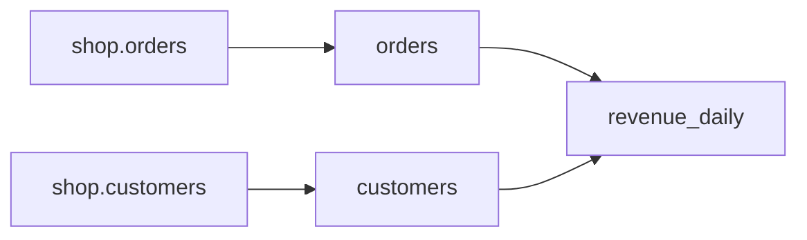

# Lineage

orders + customers -> revenue_daily

How the shop data flows from the raw sources to the marts.

```mermaid
flowchart LR
  src_orders[shop.orders] --> orders
  src_customers[shop.customers] --> customers
  orders --> revenue_daily
  customers --> revenue_daily
```

`orders` is incremental on `updated_at`; `customers` is rebuilt every run.
